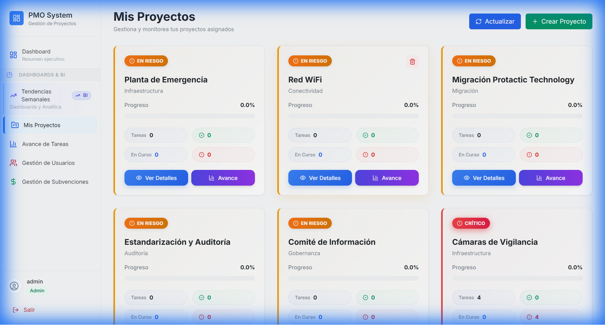

# PMO MVP - Project Management Office System

> 🚀 **A modern, full-stack project portfolio management system** replacing manual Excel-based workflows with real-time web application.

<div align="center">



[](https://react.dev/)
[](https://nodejs.org/)
[](https://tailwindcss.com/)
[](https://expressjs.com/)

</div>

## 📋 Overview

PMO MVP is an enterprise-grade project portfolio management system built to centralize project tracking, automate status reports, and provide executive visibility through real-time dashboards. The system features role-based access control, automated alerting, and comprehensive audit logging.

### ✨ Key Features

- **🎯 Role-Based Access Control** - CEO, CTO, PM, and Admin roles with granular permissions
- **📊 Real-Time Dashboards** - Executive KPIs, charts, and portfolio analytics
- **⚡ Premium UI** - Modern design with glassmorphism effects and smooth animations
- **🔔 Smart Alerts** - Automated notifications for delays and critical issues
- **📈 Project Health Tracking** - Visual status indicators with health badges
- **✅ Project Completion Flow** - Streamlined completion workflow with celebration effects
- **📝 Audit Logging** - Complete activity tracking for compliance
- **🎨 Responsive Design** - Works seamlessly on desktop, tablet, and mobile

## 🖼️ Screenshots

### Projects Dashboard

*Premium project cards with health-based styling, progress tracking, and status indicators*

### Features Highlighted

- **Health Badges** - Color-coded status (Excellent, Good, At Risk, Critical, Completed)
- **Progress Animations** - Smooth animated progress bars with gradients
- **Stats at a Glance** - Quick metrics for tasks, completion, and delays
- **Smart Actions** - Context-aware buttons for viewing, tracking, and completion

## 🚀 Quick Start

### Prerequisites

- Node.js 18+ 
- npm or yarn

### Installation

```bash
git clone https://github.com/Bonzerandres/pmo-mvp.git
cd pmo-mvp

npm install

npm run db:init

npm run dev
```

The application will be available at:
- **Frontend**: http://localhost:5173
- **Backend API**: http://localhost:3001

### Demo Credentials

| Username | Password | Role | Access |
|----------|----------|------|--------|
| `admin` | `admin123` | Admin | Full CRUD access |
| `ceo` | `ceo123` | CEO | Dashboard & analytics (read-only) |
| `pm1` | `pm123` | PM | Assigned projects (edit) |

## 🎯 Use Cases

### For Executives (CEO/CTO)
- View portfolio health at a glance
- Monitor project progress in real-time
- Receive automated alerts for critical issues
- Track KPIs and performance metrics

### For Project Managers (PM)
- Update assigned projects
- Track task completion
- Mark projects as complete
- View detailed progress metrics

### For Administrators
- Create and manage projects
- Assign projects to team members
- Manage users and permissions
- Access complete system controls

## 🛠️ Tech Stack

### Frontend
- **React 18** - Modern UI with hooks
- **Tailwind CSS** - Utility-first styling
- **Vite** - Lightning-fast build tool
- **Recharts** - Data visualization
- **Lucide React** - Beautiful icons

### Backend
- **Node.js + Express** - REST API server
- **SQLite** - Lightweight database (easily migrated to PostgreSQL)
- **JWT Authentication** - Secure token-based auth
- **bcryptjs** - Password hashing

## 📁 Project Structure

```
pmo-mvp/
├── frontend/               # React application
│   ├── src/
│   │   ├── components/    # React components
│   │   ├── context/       # Auth & Toast contexts
│   │   ├── services/      # API service layer
│   │   └── App.jsx        # Main app component
│   └── vite.config.js
├── backend/               # Express API server
│   ├── models/           # Data models
│   ├── routes/           # API routes
│   ├── middleware/       # Auth & logging
│   ├── database.js       # DB configuration
│   └── server.js         # Server entry point
└── docs/                 # Documentation & assets
```

## 🎨 Design Highlights

### Premium Project Cards
- **Glassmorphism Effects** - Modern, translucent design
- **Status-Based Styling** - Color-coded borders and backgrounds
- **Hover Animations** - Smooth lift and shadow effects
- **Gradient Buttons** - Eye-catching CTAs with hover states

### Health-Based Indicators
- 🟢 **Excellent** - On track, >80% progress
- 🔵 **Good** - Normal progress
- 🟡 **At Risk** - Behind schedule or low progress
- 🔴 **Critical** - Severely delayed or critical tasks
- ✨ **Completed** - Project finished with celebration badge

## 📊 Analytics & Insights

- **Portfolio Summary** - Total projects, completion rate, avg progress
- **KPI Dashboard** - Key metrics with trend indicators
- **Alert Center** - Critical notifications and warnings
- **Progress Tracking** - Visual charts and graphs
- **Earned Value** - PV/EV/SV calculations for financial tracking

## 🔐 Security Features

- **JWT Authentication** - Secure session management
- **Password Hashing** - bcrypt with salt rounds
- **Role-Based Permissions** - Granular access control
- **Activity Logging** - Complete audit trail
- **Input Validation** - express-validator middleware

## 📝 API Documentation

### Authentication
- `POST /api/auth/login` - User login
- `GET /api/auth/me` - Get current user

### Projects
- `GET /api/projects` - List accessible projects
- `GET /api/projects/:id` - Get project details
- `POST /api/projects` - Create project (Admin)
- `PUT /api/projects/:id` - Update project
- `DELETE /api/projects/:id` - Delete project (Admin)

### Dashboard
- `GET /api/dashboard/kpis` - Get KPIs
- `GET /api/dashboard/alerts` - Get alerts
- `GET /api/dashboard/portfolio-summary` - Portfolio metrics

## 🚀 Deployment

The application is production-ready and can be deployed to:
- **Frontend**: Vercel, Netlify, or any static hosting
- **Backend**: Heroku, Railway, Render, or VPS
- **Database**: PostgreSQL for production (simple migration from SQLite)

## 📈 Roadmap

- [ ] WebSocket integration for real-time updates
- [ ] Email notifications
- [ ] File attachments for projects
- [ ] Advanced reporting and exports
- [ ] Mobile native apps (React Native)
- [ ] Integration with external tools (Jira, Slack)

## 👨‍💻 Developer

**Andres Bonzer**
- GitHub: [@Bonzerandres](https://github.com/Bonzerandres)
- LinkedIn: [Your LinkedIn]
- Portfolio: [Your Portfolio]

## 📄 License

This project was developed as an MVP to modernize project portfolio management. Feel free to use it as reference or inspiration for your own projects.

---

<div align="center">

**Built with ❤️ using React, Node.js, and modern web technologies**

*Transforming project management from spreadsheets to real-time dashboards*

</div>
